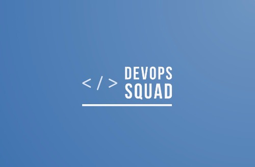

# Welcome to the DevOps Squad!

You have been brought into a scenario where our entire DevOps team just vanished over night. ~~We suspect it could be an alien abduction, since some of our engineers brought up UFO sightings in the stand-ups last week~~ (_Needs peer review_).

### Our Goal

We are planning for the big release of our **Hello World Application** by end of the day

Our DevOps team was working day and night to get this application onto the CICD pipeline but, unfortunately they couldnt complete it, which is where you come in!

# Listed below are our next steps!

### Onboard our flagship application onto the CICD pipeline

**Status:** In-progress

**Application Code:** https://github.com/DevOpsTestLab/sample-spring-boot

**Description:** 

The DevOps team picked up this work as part of the CICD onboarding but, unfortunately they couldn't complete it.

Below is the block diagram of how the pipeline should look like. _The blocks in RED needs your attention._

## Below is the list of tasks where your help is required:

### Task 1: "Dockerize" the application

> Description: Here is our flagship application which needs to be onboarded, https://github.com/DevOpsTestLab/sample-spring-boot. Download and re-upload this repository under your own azure devops project so that you can work on it independently. We are hyped about containers and microservices based deployments. The application has been built on springboot. Please help us containerize it. You are free to pick any appropriate base image from Dockerhub. Create a `Dockerfile` which can package our application jar file.

> **Note**: Our team had a conversation with the application team and found that the application can be launched using the following command, `java -jar app.jar`. We hope this information can be of some help during your "containerzation" effort.

***

### Task 2: Setup a new azure devops pipeline for our hello world app

> Description: Its time to finally do what we are good at, Onboard application onto the CICD pipeline!. Create an Azure DevOps pipeline (Use [YAML pipeline](https://docs.microsoft.com/en-us/azure/devops/pipelines/yaml-schema?view=azure-devops&tabs=schema%2Cparameter-schema) only. Not the Classic pipeline). Divide the pipeline into `Compile`, `SonarQubeScan`, `DockerBuildandPush` and `KubeDeploy` stages. The team had started working on the pipeline but no one knows where they left of or whatever they worked on, even works! Feel free to look up the `azure-pipelines.yml` file in the app repo to check their progress.

> **Note**: Feel free to use (but, dont restrict yourself to just using) the [containers](https://docs.microsoft.com/en-us/azure/devops/pipelines/process/container-phases?view=azure-devops#single-job) option in the Azure pipelines to pick the right environment for your builds.

***

### Task 3: Setup sonarqube scan for this project

> Description: We would like to get visibility on our code quality. Please integrate sonarqube in our pipeline. Here are the details below of our sonarqube server, https://sonarcloud.io/. Please integrate your GITHUB account with sonarcloud and create an organization. Update the `azure-pipelines.yml` to include a new stage called `SonarQubeScan` and add the logic to scan the project. You can either choose a container as your build environment or choose to download and install the [sonar-scanner](https://github.com/SonarSource/sonar-scanner-cli) on your [azure hosted environment](https://docs.microsoft.com/en-us/azure/devops/pipelines/agents/hosted?view=azure-devops&tabs=yaml) during build time. Use the [Azure DevOps variables](https://docs.microsoft.com/en-us/azure/devops/pipelines/process/variables?view=azure-devops&tabs=yaml%2Cbatch#secret-variables) to store your sonarcloud tokens and use them in your pipeline

> **Note**: Please make sure that you dont interfere with the ongoing development on the master branch. Follow branching and merging strategies as much as possible. You may have to carry forward your build artifacts eg: the class files from the previous stage for sonarqube scan. Please explore artifacts and dependencies in your azure devops pipeline to efficiently achieve it.

> Here are some useful links, 
- https://sonarcloud.io/documentation/analysis/analysis-parameters/
- https://docs.microsoft.com/en-us/azure/devops/pipelines/artifacts/pipeline-artifacts?view=azure-devops&tabs=yaml
- https://docs.microsoft.com/en-us/azure/devops/pipelines/process/stages?view=azure-devops&tabs=yaml#specify-dependencies
- https://docs.microsoft.com/en-us/azure/devops/pipelines/process/variables?view=azure-devops&tabs=yaml%2Cbatch
***

### Task 4: Setup docker build and docker push

> Description: Use the `Dockerfile` you have created in Task 1 and create a Azure DevOps Stage to perform a docker build and docker push to [DockerHub](https://hub.docker.com/). You can combine the docker build and docker push stages into one. Use the [Azure DevOps variables](https://docs.microsoft.com/en-us/azure/devops/pipelines/process/variables?view=azure-devops&tabs=yaml%2Cbatch#secret-variables) to store your docker hub credentials and use them in your pipeline

> **Note**: Please make sure to not interfere with the ongoing development on the master branch. Follow branching and merging strategies as much as possible. Feel free to look up in dockerhub for any docker images that you can find to use as the execution environment. You can use your personal credentials to perform the docker push from Azure DevOps. Tag the docker images as per the git commit sha. 

***

### Task 5: Setup Application deployment onto the Kubernetes Cluster

> Description: Based on the latest update from the DevOps team, one of the engineers was "working" on creating the manifest file(`kubernetes.yml`) for our application. You should see a `kubernetes.yml` in the repo. **Review the file carefully**, it should have a deployment and the service definitions. Make any changes to it in-order to support this deployment. Setup a new stage in `azure-pipelines.yml` for App deployment and implement the deployment to your kubernetes instance.

> **Note**: Please make sure to not interfere with the ongoing development on the master branch. Follow branching and merging strategies as much as possible. The multi-branch pipeline will spin up automated jobs for each new branch you create. Feel free to look up in dockerhub for any docker images that you can find to use as the execution environment. For this you would need an execution environment with kubectl in it.